<h1>Creating Windows and Linux Virtual Machines in Microsoft Azure</h1>

This is a step-by-step tutorial that walks you through creating both Windows and Linux Virtual Machines (VMs) using the Microsoft Azure portal. It's designed for beginners in IT and cybersecurity to gain hands-on experience with cloud infrastructure.
<h2>🧰 Prerequisites</h2>

- A free or paid <a href="https://azure.microsoft.com/en-us/free/">Microsoft Azure account</a>
<h2>🖥️ Environments & Tools Used</h2>

- Microsoft Azure (Portal)

<h2>🧑‍💻 Operating Systems Used</h2>

- Windows 11 (host system)
- Windows 10 Pro (22H2) [VM]
- Ubuntu Server 22.04 [VM]
<h2>📋 Project Steps Overview</h2>

- Create a Resource Group in Azure  
- Create a Windows Virtual Machine (inside the same Resource Group)  
- Create a Linux Virtual Machine (inside the same Resource Group)   
- Stop & Delete resources to manage costs
<h2>☁️ Step 1: Create a Resource Group in Azure</h2>

- Navigate to the [Azure Portal](https://portal.azure.com/) and sign in with your Microsoft account.

- In the top search bar, type **"Resource Groups"** and select it from the dropdown options.

  <!-- Screenshot: Azure portal with "Resource Groups" being searched -->
  

  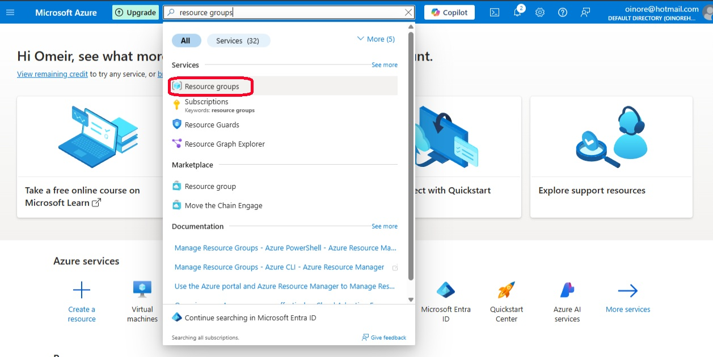

- On the Resource Groups page, click on **+ Create** to begin creating a new resource group.

  <!-- Screenshot: Click on Create button in Resource Groups -->
  

    
  

- In the **Create Resource Group** form:
  - Ensure the correct **Subscription** is selected.
  - Enter a name for your resource group (e.g., `VM-RG`).
  - Choose a **Region** (recommended: **East US 2** - This region will be selected for ALL Region options coming forward as it will save you from encountaring future headaches).

  <!-- Screenshot: Resource Group creation form filled out -->
  

    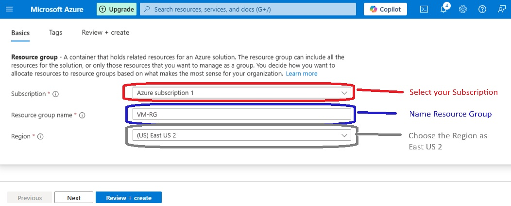
  

- After entering the required information, click **Review + Create**, then click **Create** on the next screen to deploy the resource group.

  <!-- Screenshot: Review + Create screen before final confirmation -->
  

    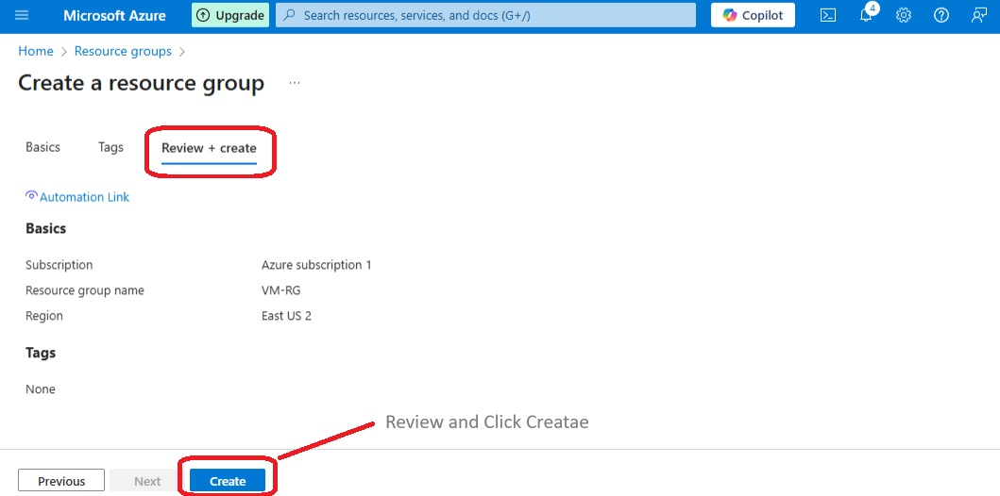
  

- Once the deployment is complete, you’ll see your newly created resource group listed on the Resource Groups dashboard.

  <!-- Screenshot: Resource Group successfully created and visible -->
  

    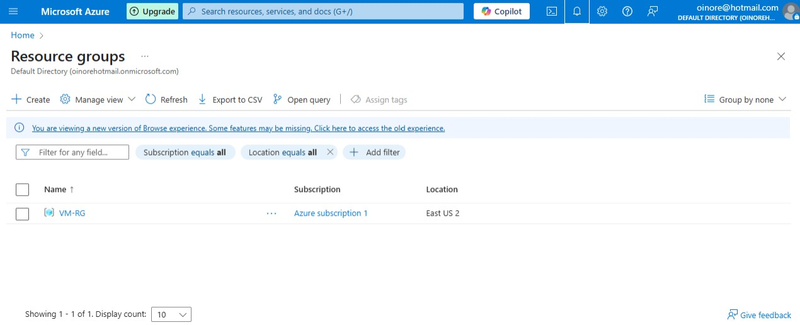
  

> 💡 **Note:** Ensure you use the same region for all other resources (VMs, virtual networks, etc.) to maintain consistency and avoid compatibility issues.
<h2>🪟 Step 2: Create a Windows Virtual Machine in Azure</h2>

- From the Azure Portal dashboard, locate the search bar at the top and search for **"Virtual machines"**.

  <!-- Screenshot: Azure Portal showing search for "Virtual machines" -->
  

    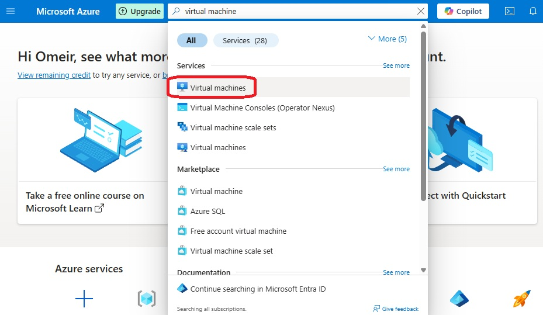
  

- On the **Virtual Machines** page, click **+ Create** and then choose **Azure virtual machine** from the dropdown.

  <!-- Screenshot: Virtual Machines page with "+ Create" button and dropdown -->
  

    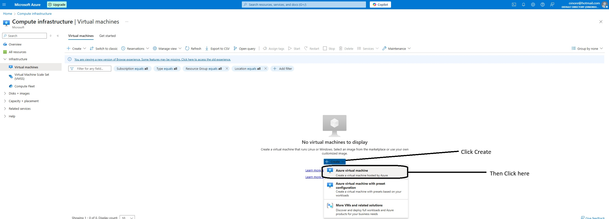
  

- In the **Basics** tab of the Create VM form:
  - Select the same **Resource Group** you created earlier (e.g., `vm-lab-rg`)
  - Enter the **Virtual Machine name**: `windows-vm`
  - Choose the same **Region** as your resource group (e.g., East US 2)
  - For **Image**, select: **Windows 10 Pro, version 22H2**

  <!-- Screenshot: Basics tab with name, region, and image filled -->
  

    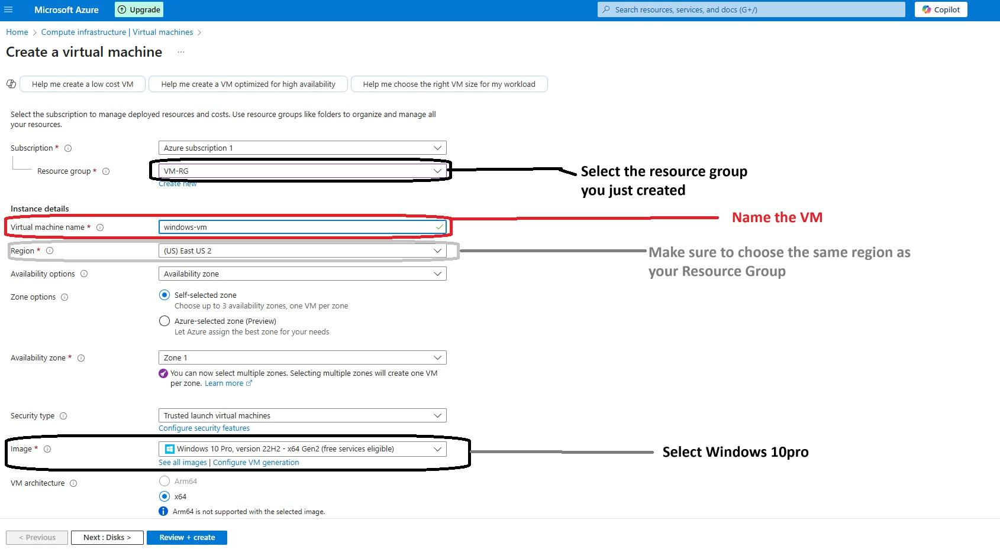
  

- Under **Size**, select:
  - **Standard_D2s_v3** (2 vCPUs, 8 GiB memory)
  - If this size is not visible, click **See all sizes** and select one with similar specs.

  <!-- Screenshot: VM size selection screen -->
  

    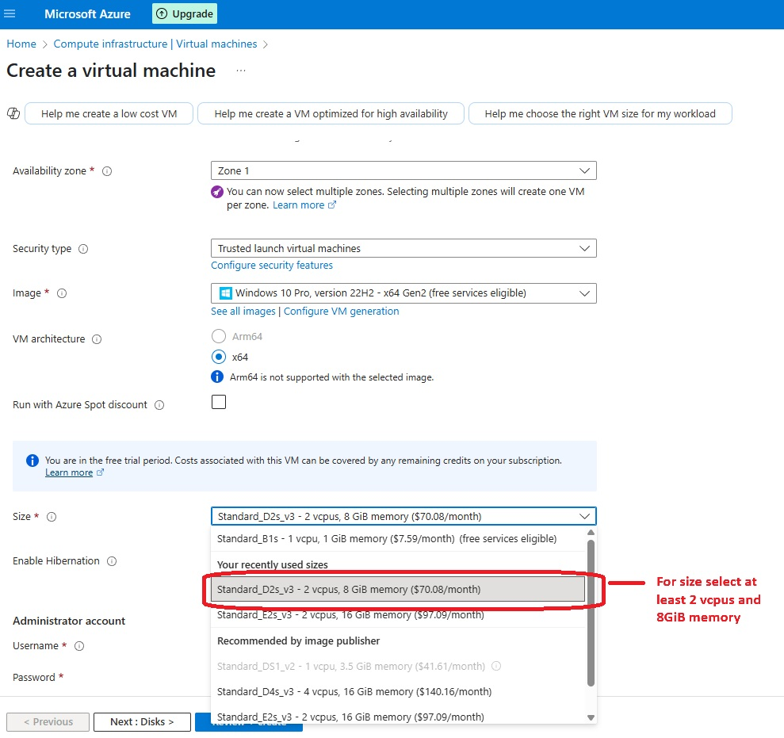
  

- In the **Administrator Account** section:
  - Choose **Username** and **Password** (save this info — it’s needed for RDP login later)
  - Under **Licensing**, check the box to confirm you have a license for Windows 10

  <!-- Screenshot: Admin username/password fields and licensing checkbox -->
  

    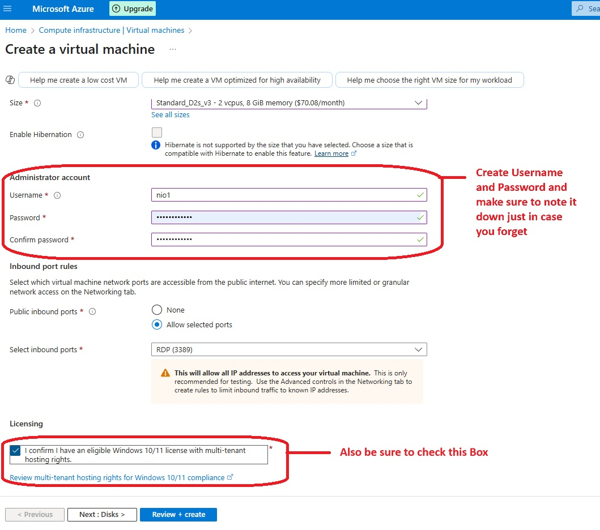
  

- Click **Next: Disks** and leave the default settings.

- Click **Next: Networking** and configure the following:
  - Azure may auto-generate a **Virtual Network**; you can use it or name your own.
  - Leave **Subnet** and **Public IP** as default
  - Ensure **RDP (Port 3389)** is enabled so you can connect to your VM

  <!-- Screenshot: Networking tab with RDP selected and virtual network configured -->
  

    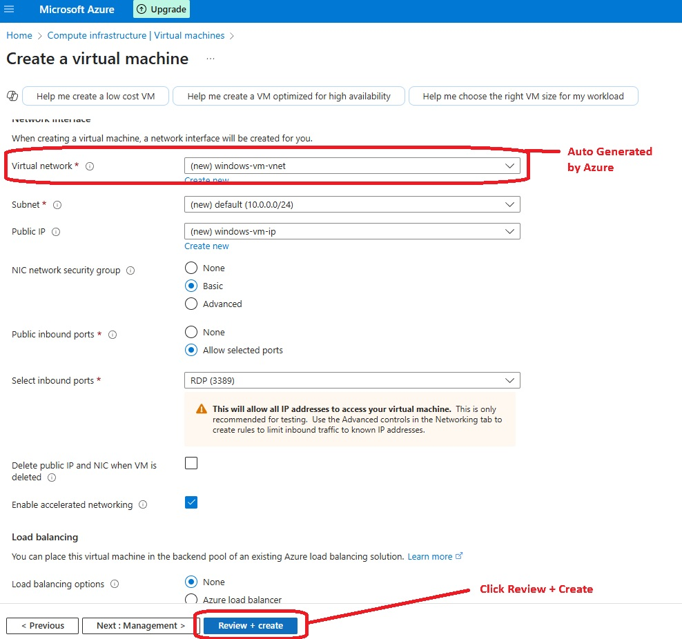
  

- Click **Review + Create** to review your configuration.
  - Double-check: Resource Group, Region, VM name, OS image, and RDP access.

  <!-- Screenshot: Review + Create summary for Windows VM -->
  

    
  

- Once the deployment is complete, you'll see a confirmation message.
  - Click **Go to resource** to manage or connect to your VM.

  <!-- Screenshot: Deployment complete and VM overview screen -->
  

    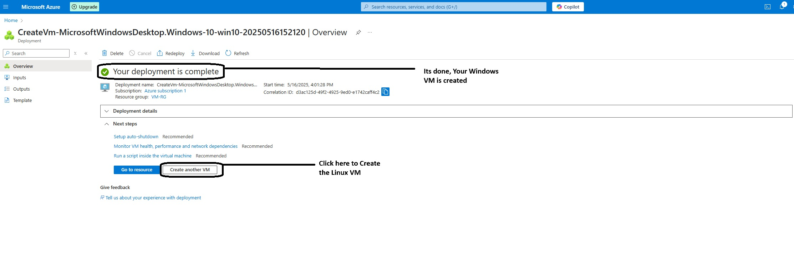
  

> 💡 **FYI:** RDP (Remote Desktop Protocol) allows you to access your Windows VM just like you would a physical computer. You’ll need the public IP address, username, and password you just created.

