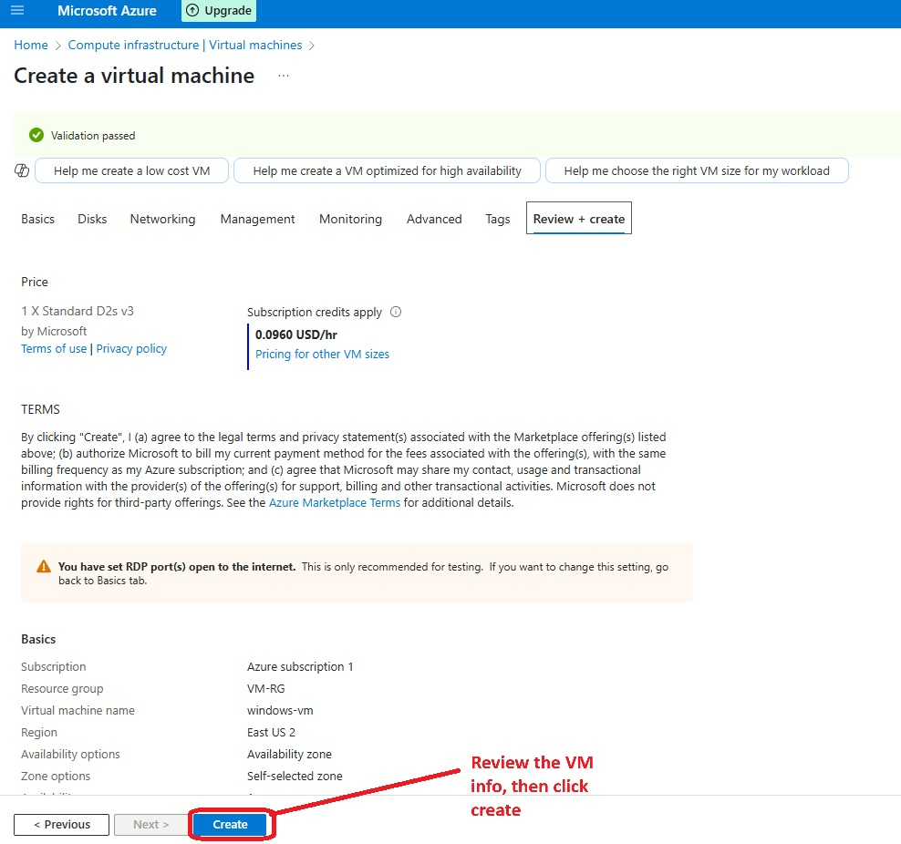
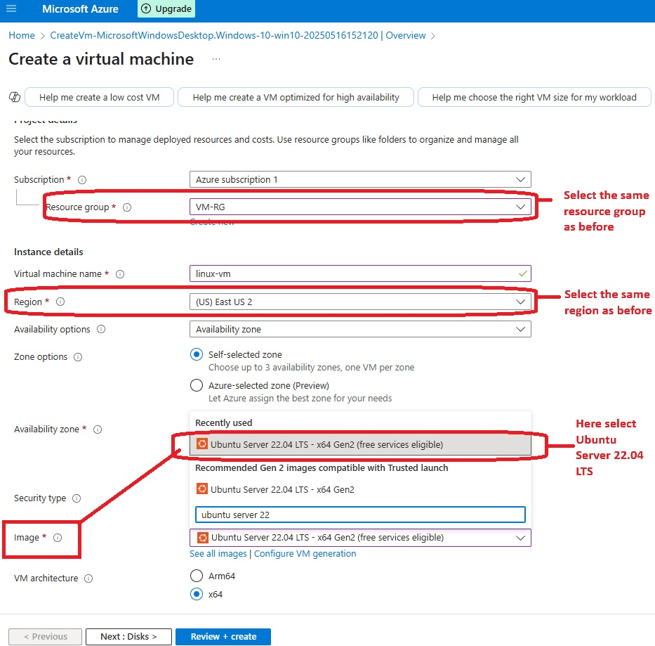
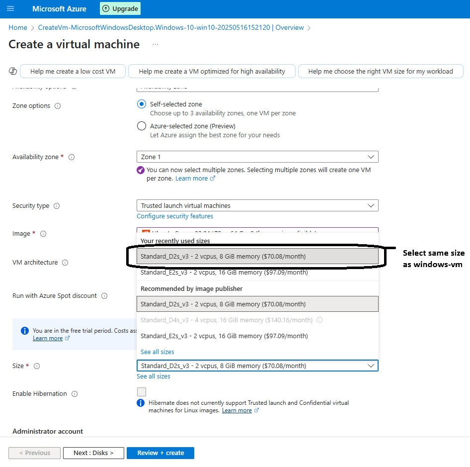
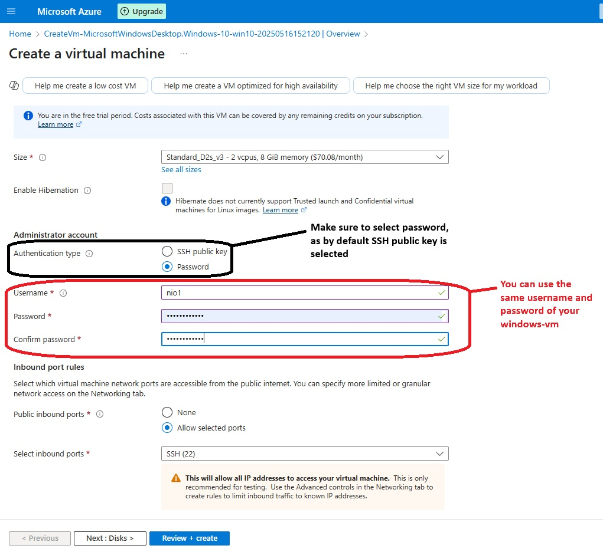
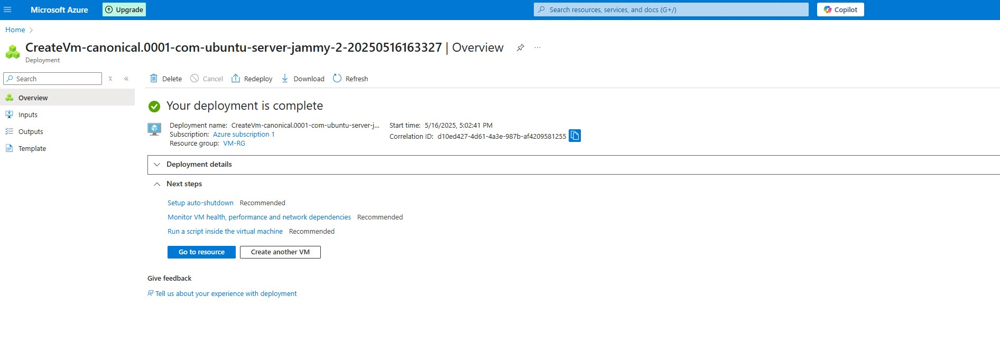

<h1>Creating Windows and Linux Virtual Machines in Microsoft Azure</h1>

This is a step-by-step Project that walks you through creating both Windows and Linux Virtual Machines (VMs) using the Microsoft Azure portal. It's designed for beginners in IT and cybersecurity to gain hands-on experience with cloud infrastructure.
<h2>🧰 Prerequisites</h2>

- A free or paid <a href="https://azure.microsoft.com/en-us/free/">Microsoft Azure account</a>
<h2>🖥️ Environments & Tools Used</h2>

- Microsoft Azure (Portal)

<h2>🧑‍💻 Operating Systems Used</h2>

- Windows 11 (host system)
- Windows 10 Pro (22H2) [VM]
- Ubuntu Server 22.04 [VM]
<h2>📋 Project Steps Overview</h2>

- Create a Resource Group in Azure  
- Create a Windows Virtual Machine (inside the same Resource Group)  
- Create a Linux Virtual Machine (inside the same Resource Group)   
- Stop & Delete resources to manage costs
<h2>☁️ Step 1: Create a Resource Group in Azure</h2>

- Navigate to the [Azure Portal](https://portal.azure.com/) and sign in with your Microsoft account.

- In the top search bar, type **"Resource Groups"** and select it from the dropdown options.

  <!-- Screenshot: Azure portal with "Resource Groups" being searched -->
  

  

- On the Resource Groups page, click on **+ Create** to begin creating a new resource group.

  <!-- Screenshot: Click on Create button in Resource Groups -->
  

    
  

- In the **Create Resource Group** form:
  - Ensure the correct **Subscription** is selected.
  - Enter a name for your resource group (e.g., `VM-RG`).
  - Choose a **Region** (recommended: **East US 2** - This region will be selected for ALL Region options coming forward as it will save you from encountaring future headaches).

  <!-- Screenshot: Resource Group creation form filled out -->
  

    
  

- After entering the required information, click **Review + Create**, then click **Create** on the next screen to deploy the resource group.

  <!-- Screenshot: Review + Create screen before final confirmation -->
  

    
  

- Once the deployment is complete, you’ll see your newly created resource group listed on the Resource Groups dashboard.

  <!-- Screenshot: Resource Group successfully created and visible -->
  

    
  

> 💡 **Note:** Ensure you use the same region for all other resources (VMs, virtual networks, etc.) to maintain consistency and avoid compatibility issues.
<h2>🪟 Step 2: Create a Windows Virtual Machine in Azure</h2>

- From the Azure Portal dashboard, locate the search bar at the top and search for **"Virtual machines"**.

  <!-- Screenshot: Azure Portal showing search for "Virtual machines" -->
  

    
  

- On the **Virtual Machines** page, click **+ Create** and then choose **Azure virtual machine** from the dropdown.

  <!-- Screenshot: Virtual Machines page with "+ Create" button and dropdown -->
  

    
  

- In the **Basics** tab of the Create VM form:
  - Select the same **Resource Group** you created earlier (e.g., `VM-RG`)
  - Enter the **Virtual Machine name**: `windows-vm`
  - Choose the same **Region** as your resource group (e.g., East US 2)
  - For **Image**, select: **Windows 10 Pro, version 22H2**

  <!-- Screenshot: Basics tab with name, region, and image filled -->
  

    
  

- Under **Size**, select:
  - **Standard_D2s_v3** (2 vCPUs, 8 GiB memory)
  - If this size is not visible, click **See all sizes** and select one with similar specs.

  <!-- Screenshot: VM size selection screen -->
  

    
  

- In the **Administrator Account** section:
  - Choose **Username** and **Password** (save this info — it’s needed for RDP login later)
  - Under **Licensing**, check the box to confirm you have a license for Windows 10

  <!-- Screenshot: Admin username/password fields and licensing checkbox -->
  

    
  

- Click **Next: Disks** and leave the default settings.

- Click **Next: Networking** and configure the following:
  - Azure may auto-generate a **Virtual Network**; you can use it or name your own.
  - Leave **Subnet** and **Public IP** as default
  - Ensure **RDP (Port 3389)** is enabled so you can connect to your VM

  <!-- Screenshot: Networking tab with RDP selected and virtual network configured -->
  

    
  

- Click **Review + Create** to review your configuration.
  - Double-check: Resource Group, Region, VM name, OS image, and RDP access.

  <!-- Screenshot: Review + Create summary for Windows VM -->
  

    
  

- Once the deployment is complete, you'll see a confirmation message.
  - Click **Go to resource** to manage or connect to your VM.

  <!-- Screenshot: Deployment complete and VM overview screen -->
  

    
  

> 💡 **FYI:** RDP (Remote Desktop Protocol) allows you to access your Windows VM just like you would a physical computer. You’ll need the public IP address, username, and password you just created.
 <h2>🐧 Step 3: Create a Linux Virtual Machine in Azure</h2>

- After deploying the Windows VM, you are automatically taken to the **Virtual Machine creation form** for your next VM. Let's now configure the Linux VM.

- In the **Basics** tab:
  - Select the same **Resource Group** used for your Windows VM (e.g., `VM-RG`)
  - Name the virtual machine: `linux-vm`
  - Choose the same **Region** as before (e.g., East US 2)
  - For **Image**, select **Ubuntu Server 22.04 LTS**

  <!-- Screenshot: Basics tab filled for Linux VM -->
  

    
  

- Under **Size**, select:
  - **Standard_D2s_v3** (2 vCPUs, 8 GiB memory) or a similar configuration if unavailable

  <!-- Screenshot: VM size selected for Linux -->
  

    
  

- In the **Administrator Account** section:
  - Change **Authentication type** from SSH to **Password**
  - Set a **username** and **password**  
    *(You can reuse the same credentials used for the Windows VM to keep things simple)*

  <!-- Screenshot: Linux admin account section with password authentication selected -->
  

    
  

- Click **Next: Disks** and leave all options at their defaults.

- Click **Next: Networking**, and configure:
  - Select the **same Virtual Network** used by the Windows VM
  - Leave Subnet, Public IP, and other settings as default
  - Ensure **SSH (Port 22)** is allowed

  <!-- Screenshot: Networking tab for Linux VM with SSH enabled -->
  

    
  

- Click **Review + Create** and verify:
  - VM name is `linux-vm`
  - OS is Ubuntu 22.04
  - SSH is enabled
  - Region and Resource Group match the previous VM

  <!-- Screenshot: Review + Create screen for Linux VM -->
  

    
  

- Click **Create** to deploy the Linux virtual machine.

- After deployment completes, you will be taken to the **VM overview** screen.

  <!-- Screenshot: Linux VM deployment complete -->
  

    
  

  <h2>✅ Conclusion</h2>

  This concludes the project. We successfully created a Resource Group, a Windows VM running Windows 10 Pro, and a Linux VM running Ubuntu in Microsoft Azure. This setup highlights the power and flexibility of cloud computing and virtualization.

  With just one system—running Windows 11, I now have access to two additional machines, each running a different operating system, without needing any extra hardware or physical space. This clearly demonstrates the efficiency and cost-effectiveness that Cloud Service Providers (CSPs) like Azure offer to both individuals and organizations.

  Don’t forget to stop (turn off) your VMs when not in use to avoid unnecessary charges.  
  Thank you for checking out this project — more coming soon! 🚀

