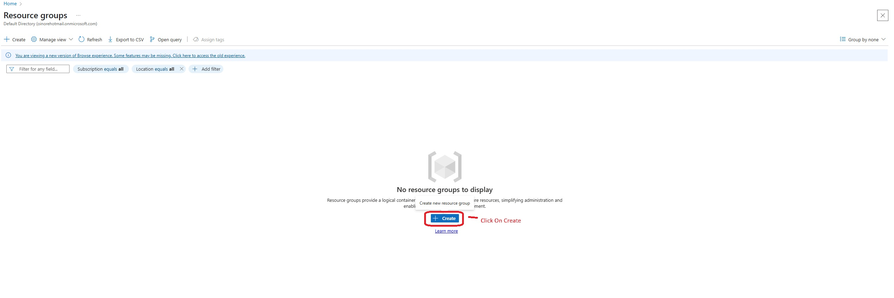

<h1>Creating Windows and Linux Virtual Machines in Microsoft Azure</h1>

This is a step-by-step tutorial that walks you through creating both Windows and Linux Virtual Machines (VMs) using the Microsoft Azure portal. It's designed for beginners in IT and cybersecurity to gain hands-on experience with cloud infrastructure.
<h2>🧰 Prerequisites</h2>

- A free or paid <a href="https://azure.microsoft.com/en-us/free/">Microsoft Azure account</a>
<h2>🖥️ Environments & Tools Used</h2>

- Microsoft Azure (Portal)

<h2>🧑‍💻 Operating Systems Used</h2>

- Windows 11 (host system)
- Windows 10 Pro (22H2) [VM]
- Ubuntu Server 22.04 [VM]
<h2>📋 Project Steps Overview</h2>

- Create a Resource Group in Azure  
- Create a Windows Virtual Machine (inside the same Resource Group)  
- Create a Linux Virtual Machine (inside the same Resource Group)   
- Stop & Delete resources to manage costs
<h2>☁️ Step 1: Create a Resource Group in Azure</h2>

- Navigate to the [Azure Portal](https://portal.azure.com/) and sign in with your Microsoft account.

- In the top search bar, type **"Resource Groups"** and select it from the dropdown options.

  <!-- Screenshot: Azure portal with "Resource Groups" being searched -->
  

  

- On the Resource Groups page, click on **+ Create** to begin creating a new resource group.

  <!-- Screenshot: Click on Create button in Resource Groups -->
  

    
  

- In the **Create Resource Group** form:
  - Ensure the correct **Subscription** is selected.
  - Enter a name for your resource group (e.g., `VM-RG`).
  - Choose a **Region** (recommended: **East US 2** - This region will be selected for ALL Region options coming forward as it will save you from encountaring future headaches).

  <!-- Screenshot: Resource Group creation form filled out -->
  

    
  

- After entering the required information, click **Review + Create**, then click **Create** on the next screen to deploy the resource group.

  <!-- Screenshot: Review + Create screen before final confirmation -->
  

    
  

- Once the deployment is complete, you’ll see your newly created resource group listed on the Resource Groups dashboard.

  <!-- Screenshot: Resource Group successfully created and visible -->
  

> 💡 **Note:** Ensure you use the same region for all other resources (VMs, virtual networks, etc.) to maintain consistency and avoid compatibility issues.

